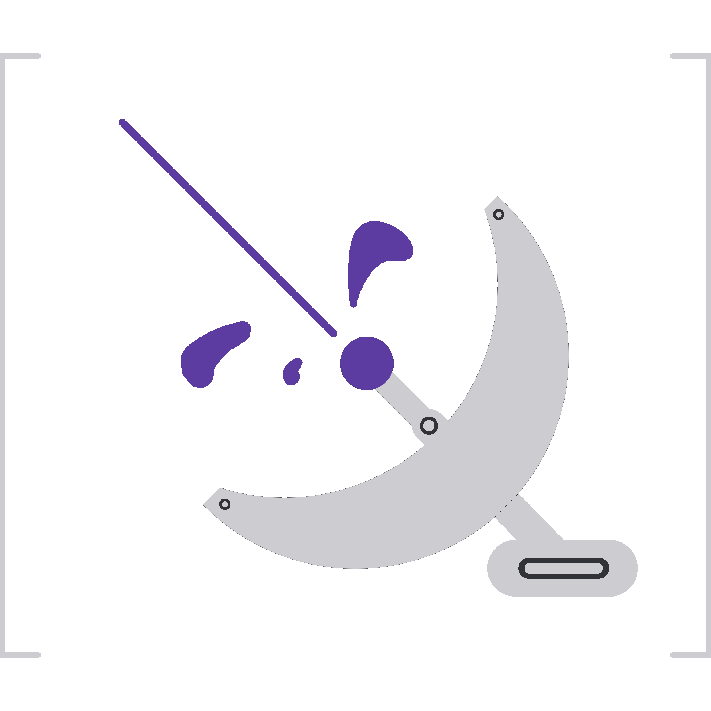

# RadioBeam

  

---

A [Matrix](https://matrix.org/) homeserver powered by the
[BEAM](https://en.wikipedia.org/wiki/BEAM_(Erlang_virtual_machine)), currently
in early development.

## Goals

### 1. Full spec compliance

As RadioBeam is currently in early development, the first and foremost goal is
to reach full compliance with the
[latest Matrix specification](https://spec.matrix.org/latest/). This includes
passing test suites such as [Complement](https://github.com/matrix-org/complement).

After achieving and maintaining core spec compliance, additional unstable
modules (like those described in [Matrix 2.0](https://matrix.org/blog/2023/09/matrix-2-0/))
may also be implemented before they are fully stabilized in the spec.

### 2. Straight-forward single-user deployment

Once RadioBeam is spec compliant, building out admin tooling and a
deployment process is the planned next step. I primarily want to make sure small
(single-user or friends & family) deployments are a nice out-of-the-box
experience by supplying great documentation, shipping with secure defaults, and
giving admins the tooling needed to effectively manage their instance.

### 3. Support for large/horizontally scaled deployments

One of my goals/challenges for this project is implementing as much as possible
without leaving the VM, primarily to play with
[Mnesia](https://www.erlang.org/doc/apps/mnesia/mnesia_overview.html) and Erlang
distribution. While this restriction is mainly for fun, it provides an opportunity
to build a distributed homeserver in the longer term.

## Status

RadioBeam is in early development (pursuing goal #1). I'm currently working on
implementing the Client-Server API in my free time. Contributions are welcome,
especially from fellow Elixir, Erlang, or Matrix enthusiasts :)

I will be adding issues to create a rough roadmap, and am happy to assign an
open issue to you if you leave a comment. Please also give **Development
Philosophy** below a quick read before contributing.

## Development Philosophy

Because I'd like to see this project progress to at least the first couple of
**Goals**, development will be on the slower side in the name of creating a
sustainable codebase. By "sustainable" I mean:

- maintaining a passing test suite with a certain level of coverage
- practicing principles like [KISS](https://en.wikipedia.org/wiki/KISS_principle),
- being thoughtful in the name of security, stability, and maintainability.

The result, I hope, will be a more reliable homeserver with a codebase that is
nice to work in and has little tech debt.
