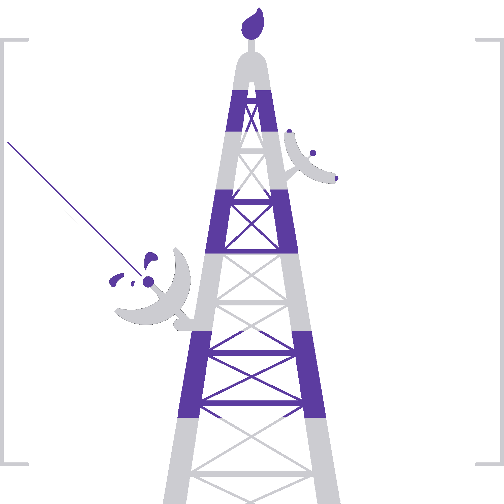

# RadioBeam

<div>
  
  
</div>

---

A [Matrix](https://matrix.org/) homeserver, powered by
[Elixir](https://elixir-lang.org/) and the
[BEAM](https://en.wikipedia.org/wiki/BEAM_(Erlang_virtual_machine)).

<br>
<br>
<br>
<br>
<br>

## Matrix Spec-compliance Table

RadioBeam is in early development. You can track which specification modules
have been implemented so far in the tables below. Some modules may not be
implemented (or at least not fully implemented) in favor of upcoming modules in
specification updates. For example, limited Legacy Auth API functionality will
be supported, in favor of the newer OAuth2 APIs.

### Client-Server API

| Module                              | Status                | Additional Notes |
|-------------------------------------|-----------------------|------------------|
| Client Config                       | ✅Implemented         |                  |
| Content Repository                  | ☑️Mostly Complete     | [#6](https://github.com/Bentheburrito/radio_beam/issues/6), [#12](https://github.com/Bentheburrito/radio_beam/issues/12), [#13](https://github.com/Bentheburrito/radio_beam/issues/13)     |
| Device Management                   | ☑️Mostly Complete     | Deleting/logging out of devices is not planned via this API (User-Interactive Authenticated is not planned. Removing devices will be done via a web UI on the homeserver. |
| Direct Messaging                    | ✅Implemented         |                  |
| End-to-End Encryption               | ✅Implemented         |                  |
| Event Annotations and reactions     | ✅Implemented         |                  |
| Event Context                       | ✅Implemented         |                  |
| Event Replacements                  | ✅Implemented         |                  |
| Guest Access                        | ❌Not Planned         | Guest users are deprecated |
| Ignoring Users                      | ✅Implemented         |                  |
| Instant Messaging                   | ✅Implemented         |                  |
| Moderation Policy Lists             | ❓Not Scoped          |                  |
| OpenID                              | ❓Not Scoped          | Possibly prefer the OAuth 2.0 APIs instead |
| Presence                            | ❌Not Planned         | There seems to be efforts to improve presence, such as [MSC4495](https://github.com/matrix-org/matrix-spec-proposals/pull/4495), so the current state of presence isn't prioritized |
| Push Notifications                  | 🗒️Planned/Not Started |                  |
| Read and Unread Markers             | ☑️Mostly Complete     | Complete impl pending Push Notifications |
| Receipts                            | ☑️Mostly Complete     | Complete impl pending Push Notifications |
| Reference Relations                 | ✅Implemented         |                  |
| Reporting Content                   | ✅Implemented         |                  |
| Room History Visibility             | ✅Implemented         |                  |
| Room Previews                       | ❓Not Scoped          |                  |
| Room Tagging                        | ✅Implemented         |                  |
| Room Upgrades                       | ✅Implemented         |                  |
| SSO Client Login/Authentication     | ❌Not Planned         | Prefer the OAuth 2.0 APIs instead |
| Secrets                             | ✅Implemented         |                  |
| Send-to-Device Messaging            | ☑️Mostly Complete     | Sending over federation remaining |
| Server Access Control Lists (ACLs)  | 🗒️Planned/Not Started |                  |
| Server Administration               | ✅Implemented         |                  |
| Server Notices                      | 🗒️Planned/Not Started |                  |
| Server Side Search                  | 🗒️Planned/Not Started |                  |
| Spaces                              | 🗒️Planned/Not Started |                  |
| Third-party Invites                 | 🗒️Planned/Not Started |                  |
| Third-party Networks                | 🗒️Planned/Not Started |                  |
| Threading                           | ✅Implemented         |                  |
| Typing Notifications                | ✅Implemented         |                  |
| User and Room Mentions              | ❓Not Scoped          |                  |
| Voice over IP                       | ❌Not Planned         | Will prefer MatrixRTC instead |

### Server-Server API

RadioBeam currently does not federate. Federation is planned once coverage of
the C-S API is relatively comprehensive (i.e. compatible with most actively
maintained clients), and the underlying project architecture stabilizes.

### Other Specification APIs and features

Below are additional APIs/features outside of the C-S and S-S APIs, including
unstable/Matrix 2.0 features

| API / Feature Name                  | Status                | Additional Notes |
|-------------------------------------|-----------------------|------------------|
| Room Versions 1-2                   | ❌Not Planned         |                  |
| Room Versions 3-11                  | ✅Implemented         |                  |
| Room Versions 12                    | ☑️Mostly Complete     |                  |
| Account Administrative Contact Info | ❌Not Planned         |                  |
| Account Locking / Suspension        | ✅Implemented         |                  |
| Application Service API             | 🗒️Planned/Not Started |                  |
| Legacy Auth / User-Interactive Auth | ❌Not Planned/Partial | UIA is not planned. Some Legacy Auth APIs are implemented, but should be considered deprecated |
| Matrix-RTC / Next-gen VoIP          | 🗒️Planned/Not Started |                  |
| OAuth 2.0                           | ☑️Mostly Complete     | Initial implementation of registration and login via authz grant, token refreshing, token refreshing - needs more testing |
| Simplified Sliding Sync             | 🗒️Planned/Not Started |                  |

## Non-protocol Features

Features unrelated to the core Matrix protocol can be created in GitHub issues.

## Contributions

I'm currently working on implementing the Client-Server API in my free time.
Contributions are welcome, especially from fellow Elixir, Erlang, or Matrix
enthusiasts :)

If you would like to contribute a feature or anything with non-trivial code
changes, please make an issue first to discuss (or leave a comment on an
existing one).

## Development Setup

If you use Nix/NixOS, a `shell.nix` and `flake.nix` are provided with a dev
shell (if you are using the flake, simply `cd radio_beam; nix develop`).

For others, you will need to install Elixir 1.18 or later, Erlang/OTP 28 or
later, and `gcc`.

Once the above are installed, you should be able to fetch dependencies, compile
the project, and run tests:

```bash
mix deps.get
mix compile
mix lint # this runs tests with `mix test` as well as the project linters
```

For the Phoenix/web development, ESBuild and Tailwind binaries will be pulled
by the Nix shell, or by running `mix assets.setup`.

## Building RadioBeam

TODO once there is something worth building :)

